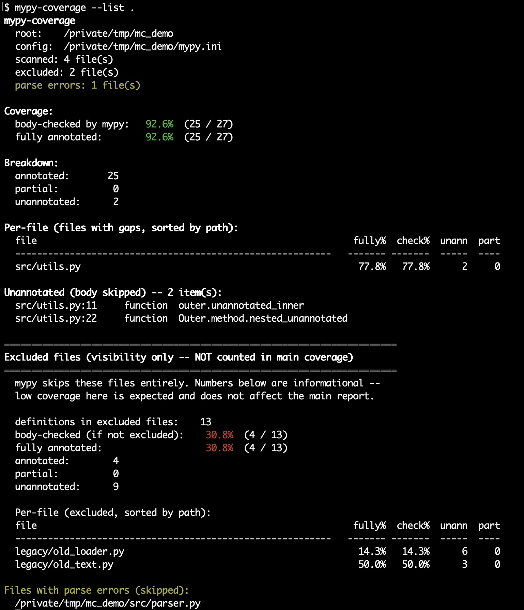

# mypy-coverage

A fast, stdlib-only CLI that reports how much of a Python codebase is
actually type-checked by mypy.

The catch with mypy's default `check_untyped_defs = False` is that **fully
unannotated functions are silently skipped** — their bodies are not
analysed and any real type errors inside them are invisible.
`mypy-coverage` enumerates exactly these, plus files covered by the
`exclude` pattern, and computes aggregate coverage percentages.

## Install

From PyPI (recommended):

```sh
pip install mypy-coverage
```

Or in an isolated environment with [pipx](https://pipx.pypa.io/):

```sh
pipx install mypy-coverage
```

### Alternative install channels

Pinned git tag:

```sh
pip install "git+https://github.com/mfisherlevine/mypy_coverage.git@v0.2.3"
```

Bleeding-edge `dev` branch:

```sh
pip install "git+https://github.com/mfisherlevine/mypy_coverage.git@dev"
```

### For local development

```sh
git clone https://github.com/mfisherlevine/mypy_coverage.git
cd mypy_coverage
pip install -e '.[dev]'
pre-commit install
pytest
```

Requires Python 3.11+. The runtime has zero third-party dependencies;
the `dev` extra pulls in `pytest`, `mypy`, `ruff`, and `pre-commit`.
Installing provides a `mypy-coverage` console script and a
`mypy_coverage` importable package (also runnable via `python -m
mypy_coverage`).

## Usage

```sh
# Scan current project (auto-detect config)
mypy-coverage

# Scan specific paths
mypy-coverage src/ tests/

# Fail CI if body-checked coverage is below 85%
mypy-coverage --threshold 85

# Full list of every unannotated definition
mypy-coverage --list

# List partially annotated ones too
mypy-coverage --list --list-partial

# Machine-readable output
mypy-coverage --format json

# GitHub Actions annotations
mypy-coverage --format github

# Flag imports that decay to Any
mypy-coverage --silent-any

# Or use python -m
python -m mypy_coverage --help
```

The package also exposes a small programmatic API:

```python
from pathlib import Path
from mypy_coverage import build_report, discover_config, load_config

cfg_path = discover_config(Path.cwd())
cfg = load_config(cfg_path) if cfg_path else None
report = build_report([Path("src")], cfg, root=Path.cwd())
print(f"{report.percent_checked():.1f}% body-checked")
for d in report.definitions:
    if d.status == "unannotated":
        print(d.file, d.lineno, d.qualname)
```

## Sample report

The default `text` format prints a colourised summary to the terminal:



`--format markdown --list` produces the same data laid out for PR
comments, GitHub issues, or this README:

> # mypy-coverage report
>
> ❌ 17 unannotated, 2 partial definition(s).
>
> - **Root:** `~/projects/example`
> - **Config:** `~/projects/example/pyproject.toml`
> - **Files scanned:** 42
> - **Files excluded:** 3
>
> ## Summary
>
> | metric | value |
> | --- | ---: |
> | ❌ body-checked by mypy | 87.2% |
> | ❌ fully annotated | 83.9% |
> | annotated | 220 |
> | partial | 2 |
> | unannotated | 17 |
>
> ## Files with gaps
>
> | file | fully typed % | body checked % | unannotated | partial |
> | --- | ---: | ---: | ---: | ---: |
> | `src/example/legacy/parser.py` | 33.3% | 66.7% | 2 | 2 |
> | `src/example/io/loader.py` | 50.0% | 50.0% | 6 | 0 |
> | `src/example/utils/text.py` | 71.4% | 71.4% | 2 | 0 |
> | `src/example/cli/commands.py` | 77.8% | 77.8% | 2 | 0 |
>
> ## Unannotated definitions (17)
>
> ### `src/example/legacy/parser.py`
>
> - L25 `parse_token` (function)
> - L29 `parse_block` (function)
>
> ### `src/example/io/loader.py`
>
> - L4 `read` (function)
> - L8 `_open` (function)
> - L12 `iter_records` (function)
> - L16 `load_async` (function)
> - L21 `Loader.add` (method)
> - L24 `Loader.flush` (method)
> - …

The same data is also available as `--format json` (machine-readable),
`--format text` (terminal-friendly with optional ANSI colour), and
`--format github` (`::warning` / `::notice` annotations on the PR diff).

## What counts as "covered"?

Each function, method, or class falls into one of four buckets:

| Status        | Meaning                                                                              |
| ------------- | ------------------------------------------------------------------------------------ |
| `annotated`   | Every param (excluding `self`/`cls`) and the return type are annotated.              |
| `partial`     | At least one annotation. Mypy **does** check the body; missing types become `Any`.   |
| `unannotated` | Zero annotations. Mypy **skips** the body when `check_untyped_defs = False`.         |
| `excluded`    | File matches the mypy `exclude` regex; mypy never sees it.                           |

Two coverage metrics are reported:

- **body-checked by mypy** = `(annotated + partial) / (total - excluded)` —
  the fraction of definitions whose bodies mypy analyses.
- **fully annotated** = `annotated / (total - excluded)` — stricter; what
  you'd get under `disallow_untyped_defs`.

## Config discovery

Walks up from the current directory looking for, in order:

1. `mypy.ini` / `.mypy.ini`
2. `setup.cfg` (with a `[mypy]` section)
3. `pyproject.toml` (with a `[tool.mypy]` table)

The tool reads:

- `check_untyped_defs` — affects how unannotated bodies are treated
- `exclude` — regex of paths mypy skips
- `files` and `mypy_path` — default set of paths to scan
- `ignore_missing_imports` per-module — powers `--silent-any`

If no config is found, the current directory is scanned with mypy defaults.

## Silent-Any detection (`--silent-any`)

A best-effort scan for syntactic patterns that usually decay to `Any`:

- **`ignored-import`** — a symbol imported from a module configured with
  `ignore_missing_imports = True`. Everything that symbol names is `Any`.
- **`untyped-decorator`** — a function decorated with a name imported from
  an ignored module. The decorator can silently erase the wrapped
  function's return type.
- **`type-ignore`** — any `# type: ignore` comment.

True "silent Any" detection (types that collapse to Any during mypy's
semantic analysis) requires actually running mypy; see the roadmap note.

## Output formats

- `text` (default) — human-readable summary, per-file table, optional
  listings
- `json` — complete machine-readable dump including per-definition records
- `markdown` — suitable for pasting in PRs and issues
- `github` — `::warning` / `::notice` annotations for GitHub Actions

## CI use

### As a GitHub Action

The repo ships a composite action so a single `uses:` line drops
mypy-coverage into any workflow:

```yaml
- uses: mfisherlevine/mypy_coverage@v0.2.3
  with:
    threshold: 85
    format: github      # ::warning / ::notice annotations on the PR diff
```

Inputs (all optional):

| Input | Default | Description |
| --- | --- | --- |
| `version` | `latest` | Pin the published mypy-coverage version, e.g. `0.2.3`. |
| `python-version` | `3.11` | Python interpreter for the install step. |
| `paths` | _(config default)_ | Space-separated paths to scan. |
| `config` | _auto-detect_ | Explicit mypy config file. |
| `root` | _config dir_ | Project root passed to `--root`. |
| `threshold` | _none_ | Fail the step if coverage < this percent. |
| `threshold-metric` | `checked` | `checked` or `fully-typed`. |
| `format` | `github` | `text` / `json` / `markdown` / `github`. |
| `sort` | `path` | `path` or `coverage`. |
| `silent-any` | `false` | Set `true` to enable silent-Any detection. |
| `include-excluded` | `true` | Show the walled-off excluded section. |
| `list` | `false` | List every unannotated definition. |
| `list-partial` | `false` | List every partial definition. |

Outputs:

| Output | Example | Notes |
| --- | --- | --- |
| `percent-checked` | `87.2` | Body-checked-by-mypy fraction, as a percent. |
| `percent-fully-typed` | `83.9` | Stricter "everything typed" fraction. |
| `unannotated` | `158` | Count of unannotated defs in the main body. |
| `partial` | `41` | Count of partials in the main body. |
| `total` | `1238` | Total defs in the main body. |

Outputs are set even when the threshold gate fails, so a follow-up
step can post a sticky PR comment with the numbers regardless.

### As a manual `pip install` step

If you'd rather not use the composite action:

```yaml
- name: mypy coverage
  run: |
    pip install mypy-coverage
    mypy-coverage --threshold 85 --format github
```

Exit codes:

- `0` — scan succeeded and, if `--threshold` was given, coverage met it
- `1` — coverage below threshold
- `2` — invalid arguments or missing config/paths

## Development

```sh
pip install -e '.[dev]'
pre-commit install   # install the git hook
pytest               # ~120 unit/integration tests
mypy                 # strict; package and tests should both be clean
mypy-coverage        # dogfood: should report 100% coverage of itself
```

Pre-commit runs `ruff` (lint + format), `mypy`, and a handful of
hygiene hooks (trailing whitespace, EOF newline, large files, merge
conflicts, debug statements). GitHub Actions CI
([.github/workflows/ci.yml](.github/workflows/ci.yml)) runs the same
pre-commit chain plus `pytest` on Python 3.11/3.12/3.13 and a self-
coverage check that must be exactly 100%. These are required status
checks before merging to `main`.

Package layout:

```
src/mypy_coverage/
  models.py        Dataclasses and status constants
  config.py        mypy.ini / setup.cfg / pyproject.toml parsing
  discovery.py     File walking, exclude-regex matching
  scanner.py       AST walk, function/method/class classification
  silent_any.py    --silent-any detection
  report.py        build_report + per-file aggregation
  render.py        text / json / markdown / github renderers
  cli.py           argparse and main entry point
```

## Limitations

- The scan is syntactic. It does **not** resolve imports, so a function
  with an annotation that references an unresolvable name is still counted
  as annotated. Running mypy itself is the only way to catch that.
- `--silent-any` is heuristic. It won't catch every path to `Any` — in
  particular, `Any` introduced by calling an untyped function returning
  `Any` is invisible without running mypy.
- Possible future flag `--deep`: shell out to `mypy
  --disallow-any-unimported --disallow-any-decorated` and merge the
  diagnostics for a more thorough silent-Any check.

## License

GPL-3.0-or-later. See [LICENSE](LICENSE). Chosen to match the wider
Rubin Observatory / LSST Pipelines ecosystem from which this tool
originated.
